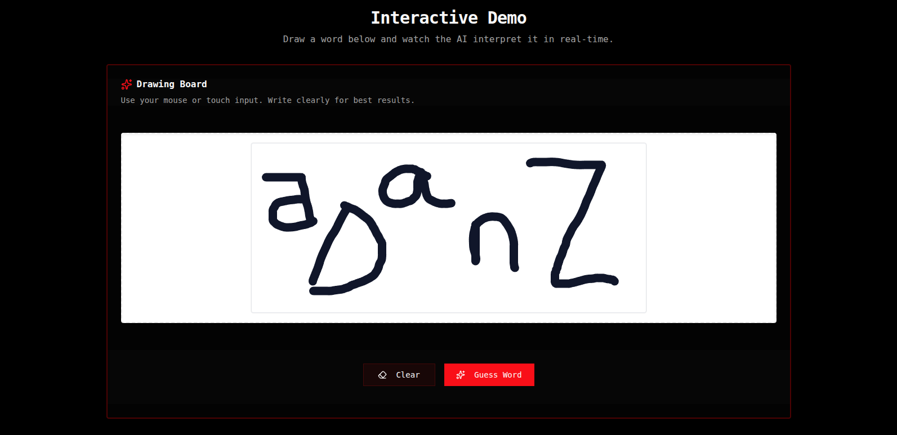
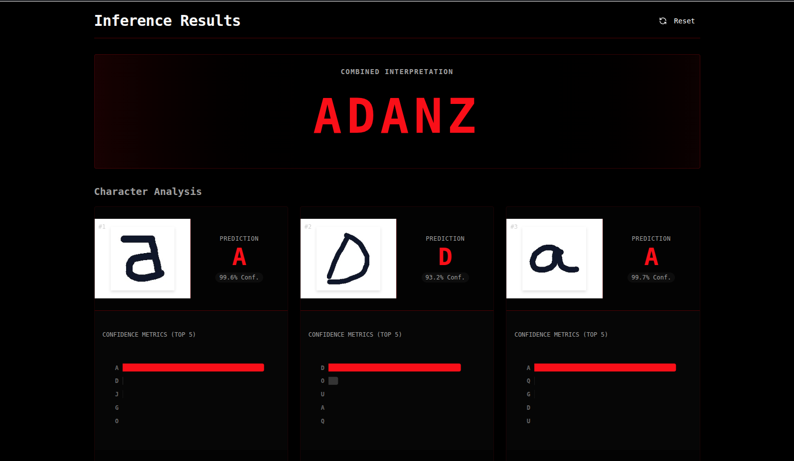
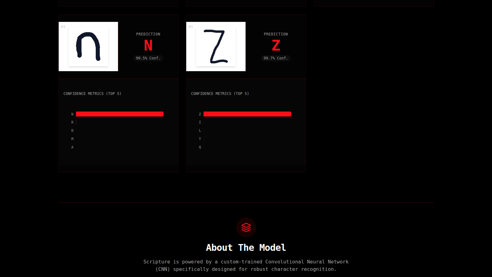

# Technical Guide: Scripture

This document outlines the technical implementation details for the Scripture application.

## 1. Project Overview

Scripture is a web application that allows users to draw words on a canvas. The application then separates each letter from the word, processes it, and sends it to a (simulated) backend for character recognition. The predicted word is then displayed to the user.

## 1.1. Visual Samples

The following images capture key stages of the current implementation:

### Input (Pre-Processing)



### Output Sample 1




## 2. Technology Stack

- **Frontend Framework:** React (with Vite for bundling)
- **Language:** TypeScript
- **Styling:** Tailwind CSS v4
- **Canvas:** `react-konva` for drawing and canvas manipulation.
- **Image Processing:** The core logic for letter extraction will be custom-built using canvas pixel data manipulation.

## 3. Project Structure

The project will follow a structured directory layout:

```
/src
|-- /assets
|-- /components
|   |-- /ui (generic, reusable components)
|   |-- /canvas
|       |-- DrawingCanvas.tsx
|-- /lib
|   |-- imageProcessor.ts (logic for letter extraction)
|-- /screens
|   |-- Landing.tsx
|-- App.tsx
|-- main.tsx
|-- index.css
```

## 4. Core Feature: Letter Extraction

The most critical part of the application is the logic to separate individual letters from the user's drawing.

### 4.1. Drawing

The user will draw on a canvas provided by `react-konva`. The drawing will be smooth and fluid, with rounded line caps and joins.

### 4.2. Image Processing and Letter Separation

1.  **Get Canvas Data:** Once the user has finished drawing, we will get the pixel data from the canvas.
2.  **Connected Component Analysis:** We will implement an algorithm to find connected components (blobs) of black pixels on the white background. This will allow us to identify individual letters, even if they consist of multiple strokes (like the letter 'i').
3.  **Bounding Box:** For each connected component, we will calculate a bounding box.
4.  **Image Extraction:** We will create a new, smaller canvas for each bounding box, and copy the pixel data for that letter into it.
5.  **Image Data:** The content of each small canvas will be converted to a data URL (base64 encoded image), which can be displayed in an `` tag.

### 4.3. (Simulated) Prediction

For the initial version, we will simulate the backend prediction. A fake prediction (e.g., a random letter or a fixed string) will be displayed below each extracted letter image.

## 5. Development Roadmap

1.  **Project Setup:** Initialize the React project with Vite and TypeScript, and configure Tailwind CSS.
2.  **Canvas Implementation:** Create the `DrawingCanvas` component.
3.  **Letter Extraction Logic:** Implement the `imageProcessor.ts` library.
4.  **UI Integration:** Connect the canvas to the extraction logic and display the results on the `Landing` screen.
5.  **Styling:** Polish the UI using Tailwind CSS to create a clean and modern look.
